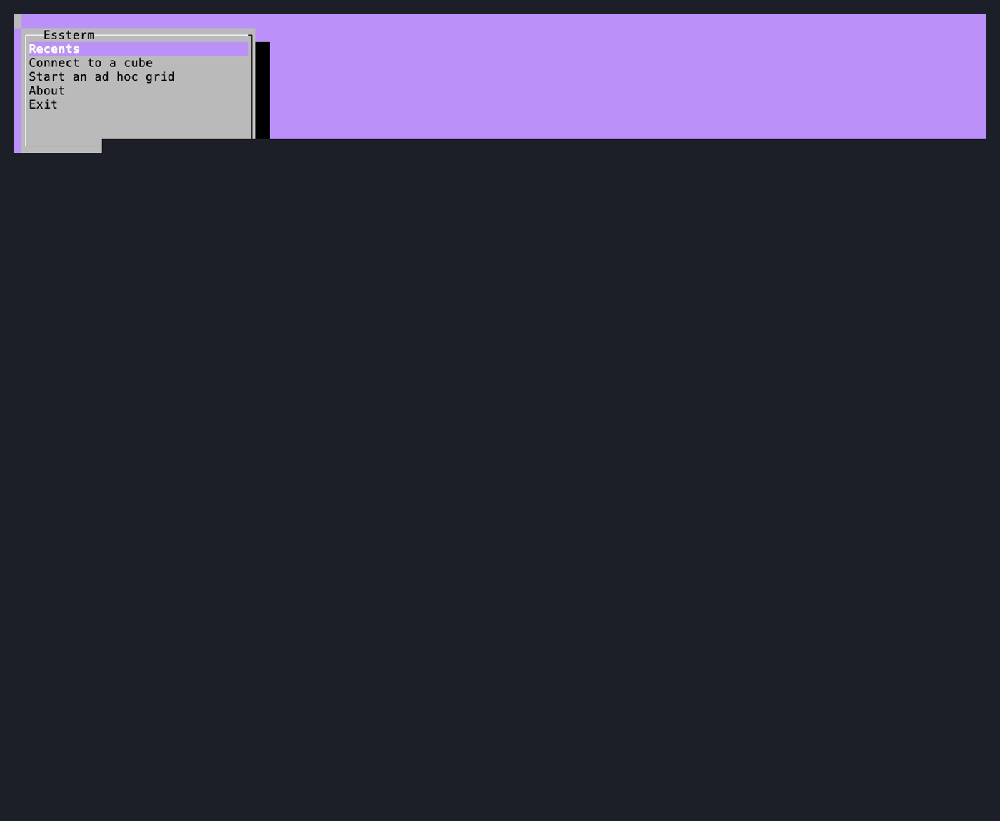
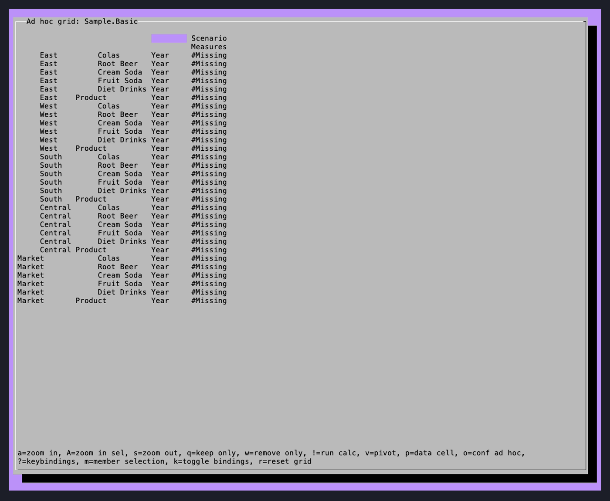
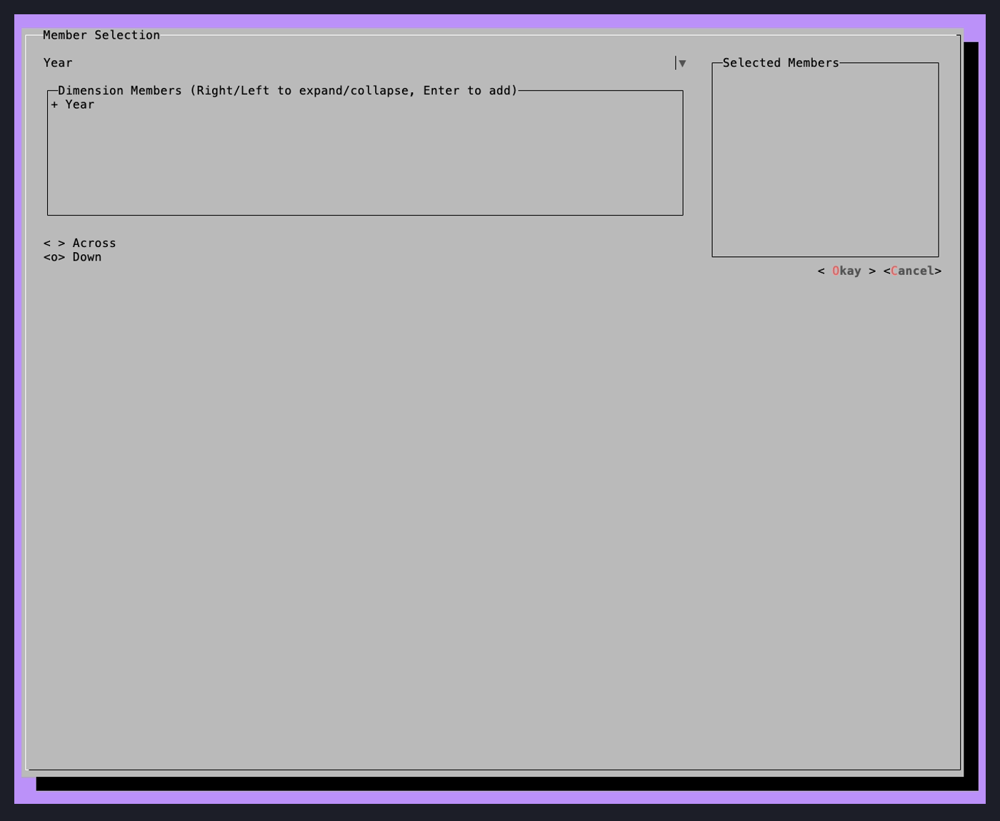
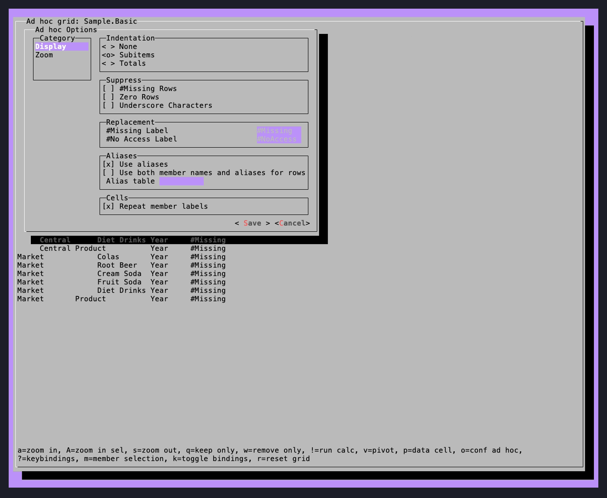

# Essterm

Essterm is a terminal (text-mode) ad hoc client for Essbase - think of it as a text-mode analog of
the classic Essbase Excel add-in or Smart View, running entirely in your terminal over SSH or
locally, no Excel or browser required.

It talks to Essbase two ways: the modern REST API, or (optionally) the classic Java API. See
[Two backends](#two-backends) below.

## Screenshots


<table>
<tr>
<td></td>
<td></td>
</tr>
<tr>
<td>Launcher menu</td>
<td>Ad hoc grid, zoomed into two dimensions at once</td>
</tr>
<tr>
<td></td>
<td></td>
</tr>
<tr>
<td>Member selection</td>
<td>Ad hoc options, mirroring the classic Display tab</td>
</tr>
</table>

These were captured with [VHS](https://github.com/charmbracelet/vhs) from the tape script in
[`demo.tape`](demo.tape) - run `vhs demo.tape` after a build to regenerate them.

## Quick start (no build required)

Just want to try it out?

1. Install Java 17 or newer if you don't already have it - [Eclipse Temurin](https://adoptium.net)
   is a good free option.
2. Download the latest `essterm-*.jar` from the
   [Releases page](https://github.com/jasonwjones/essterm/releases).
3. Open a terminal (Terminal on macOS, Command Prompt or PowerShell on Windows, your shell on
   Linux) in the folder you downloaded it to, and run:
   ```
   java -jar essterm-1.0.0.jar
   ```
   Prefer a normal, resizable window instead of whatever your terminal happens to look like? Add
   `-Dessterm.swing=true`:
   ```
   java -Dessterm.swing=true -jar essterm-1.0.0.jar
   ```

You'll need a real Essbase server to connect to - essterm is a client, not a sandbox - so have a
REST API endpoint and credentials handy and use "Connect to a cube" (or "Recents" if you've
connected before).

Prefer to build from source, or want to contribute? See [Building](#building) below.

## A testbed for essbase-rest-client

Essterm is also a deliberate testbed for
[essbase-rest-client](https://github.com/appliedolap/essbase-rest-client), a Java client library for
Essbase's REST API. A lot of essterm's REST-backed ad hoc logic exists to exercise that library
against a real server and surface exactly what its wire protocol actually does - which, for
undocumented behavior, is often a fair bit stranger than the field names suggest. Most of
essbase-rest-client's own `EssCubeView` javadoc (what's verified, what silently no-ops, what's
flat-out unconfirmed) was worked out *from* essterm, one live ad hoc operation at a time. If you're
looking to understand the REST API's real-world behavior rather than just its OpenAPI shape, that
library's `EssCubeView` interface and its `EssCubeViewIT` integration tests are worth reading
alongside this project.

## Features

- Connect to Essbase over REST or (optionally) the Java API
- Full ad hoc navigation: zoom in/out, keep only, remove only, pivot, pivot to POV
- A real member selection dialog (browse a dimension's hierarchy, place members on rows or columns)
- An ad hoc options dialog mirroring the classic "Essbase Options" dialog's Display and Zoom tabs,
  greying out whatever the active backend doesn't support
- Recent-connections list for jumping straight back into a known connection + cube
- Configurable key bindings, with an on-screen bindings bar (`k` to toggle)

## Two backends

- **REST** (default) - via essbase-rest-client, above. This is what a standard build supports out of
  the box.
- **Java API** (opt-in) - the classic Essbase JAPI. Oracle's Essbase Java API JARs aren't published
  to Maven Central and aren't ours to redistribute, so a standard build never resolves or bundles
  them. Building with `mvn package -Pjapi` (see [Building](#building)) compiles in JAPI support, but
  requires those JARs already installed in your local Maven repository. Without them, the Connect
  dialog simply greys out the Java API option and explains why.

## Requirements (building from source)

- Java 17+
- Maven

## Building

```
mvn package          # REST support only - no Oracle software involved
mvn package -Pjapi   # also compiles in Essbase Java API support (requires the Oracle JARs
                      # already installed locally - see "Two backends" above)
```

## Running

```
./run.sh              # builds, then launches
./run.sh --no-build    # skip the build, just run the existing jar
./run.sh --swing       # force Lanterna's Swing terminal window instead of the real terminal
```

App logging goes to `testFile.log`, not the console, by default - Lanterna owns the terminal's
cursor positioning while the app runs, so any concurrent console output visually corrupts the
screen.

## Key bindings

Press `?` in the ad hoc grid at any time for the full, current list. The defaults:

| Key | Action |
|-----|--------|
| `a` | Zoom in |
| `A` | Zoom in, keeping the selected member |
| `s` | Zoom out |
| `q` | Keep only |
| `w` | Remove only |
| `v` | Pivot |
| `p` | Data cell actions |
| `m` | Member selection |
| `o` | Ad hoc options |
| `!` | Run a calc script |
| `r` | Reset to the default view |
| `k` | Toggle the key bindings bar |
| `?` | Key bindings help |

## Status

This is a personal project, still rough in places - see open issues for known gaps. Contributions
are welcome; see [CONTRIBUTING.md](CONTRIBUTING.md).

## License

Apache License 2.0 - see [LICENSE](LICENSE).
